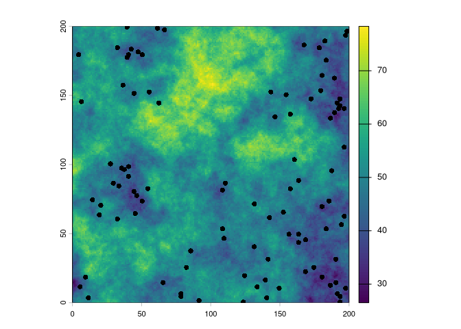
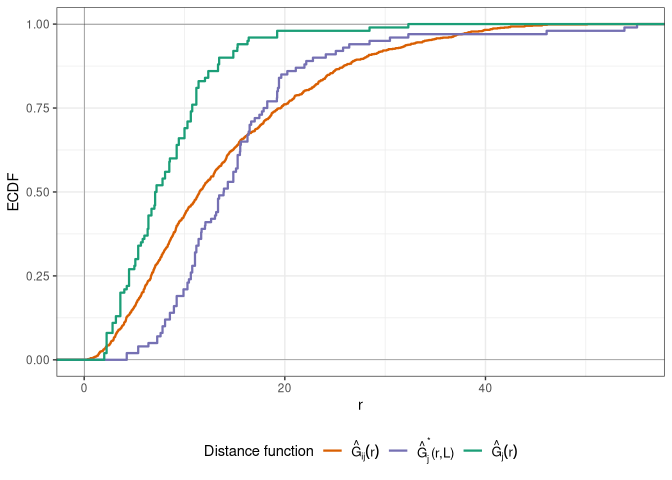
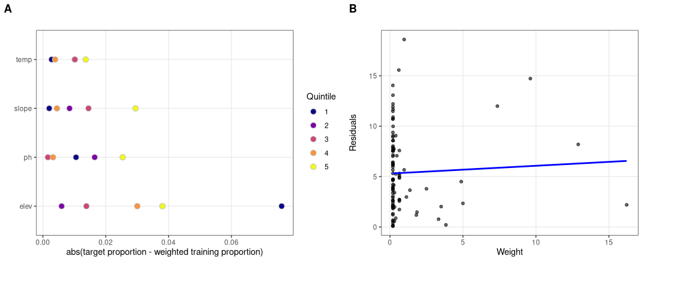

<!-- README.md is generated from README.Rmd. Please edit that file -->

# PredictionMatching

<!-- badges: start -->

<!-- badges: end -->

*Experimental*: This is an implementation of weighted evaluation based
on raking (Brenning and Suesse (2026)).

## Installation

You can install the development version of PredictionMatching from
[GitHub](https://github.com/) with:

``` r
# install.packages("pak")
pak::pak("JanLinnenbrink/PredictionMatching")
```

## Example

We use an example where the sampling effort is biased along a predictor
included in the model (e.g., towards low elevation) to demonstrate the
weighing functions implemented in this package:

``` r
library(PredictionMatching)
library(terra)
#> terra 1.9.34
library(sf)
#> Linking to GEOS 3.14.1, GDAL 3.13.1, PROJ 9.8.1; sf_use_s2() is TRUE
library(simsam)
library(caret)
#> Loading required package: ggplot2
#> Loading required package: lattice
library(cowplot)

set.seed(100)

calc_rmse <- function(pred, obs) {
  sqrt(mean((pred - obs)^2, na.rm = TRUE))
}

raster_stack <- terra::rast(system.file(
  "extdata",
  "rasters_example.tif",
  package = "PredictionMatching"
))
data(train_data)

predictor_names <- setdiff(names(raster_stack), "outcome")
predictor_stack <- raster_stack[[predictor_names]]

terra::plot(predictor_stack[["elev"]])
terra::plot(vect(train_data), add = T)
```



We train a random forest model and assess its performance using kNNDM
cross-validation (Linnenbrink et al. (2024)).

``` r
# Split the data into folds using kNNDM
knndm_folds <- CAST::knndm(
  tpoints = train_data,
  modeldomain = predictor_stack[["elev"]],
  k = 5
)
#> 1000 prediction points are sampled from the modeldomain
#> Calculating euclidean distances in geographic space (projected coordinates).

# Train a random forest model
ctrl_knndm <- trainControl(
  method = "cv",
  index = knndm_folds$indx_train,
  indexOut = knndm_folds$indx_test,
  savePredictions = "final",
  verboseIter = FALSE
)

rf_knndm <- train(
  x = st_drop_geometry(train_data)[, predictor_names],
  y = st_drop_geometry(train_data)[["outcome"]],
  method = "ranger",
  trControl = ctrl_knndm,
  metric = "RMSE",
  num.trees = 300,
  importance = "impurity"
)

knndm_rmse <- calc_rmse(rf_knndm$pred$pred, rf_knndm$pred$obs)

plot(knndm_folds)
```



We can also calculate the true RMSE in this setting:

``` r
rf_pred <- predict(predictor_stack, model = rf_knndm, na.rm = TRUE)
rf_pred_vals <- terra::values(rf_pred, mat = FALSE)
outcome_vals <- terra::values(raster_stack$outcome, mat = FALSE)
true_rmse <- calc_rmse(rf_pred_vals, outcome_vals)
true_rmse
#> [1] 7.660114
knndm_rmse
#> [1] 6.646014
```

As can be seen by comparing the RMSE estimate obtained by kNNDM to the
true RMSE, using kNNDM alone is sometimes not sufficient with biased
sampling. The reason likely is that we applied kNNDM in geographical
space, and thus could not correct for the biased sampling along
elevation (and the resulting spatially structured error field). Hence,
we will weigh the cross-validation errors using raking of the predictors
in the next step.

After obtaining the weights via `tw_calculate_weights`, we assign the
pointwise errors calculated from kNNDM to a standardized object with a
specific ID column using `tw_pointwise_error`. This is necessary because
`tw_calculate_weights` assigns weigths in the row order of the training
data, which not necessarily corresponds to the order of training points
in the resampling object obtained by caret. This is mitigated by
assigning row IDs to both, the calculated weights (which is
automatically done) and to the error object. Then, the weighted error
can be calculated by `tw_weighted_error_stats`.

``` r
# Calculate weights from raking
w <- tw_calculate_weights(
  tpoints = st_drop_geometry(train_data)[, predictor_names],
  modeldomain = predictor_stack
)
#> 1000 prediction points are sampled from the modeldomain
#> predictor values are extracted for prediction points

# Standardize the pointwise errors obtained by kNNDM CV and add an ID column
pe <- tw_pointwise_error(
  obs = rf_knndm$pred$obs,
  pred = rf_knndm$pred$pred,
  id = rf_knndm$pred$rowIndex
)

# Weigh the pointwise errors using the weights obtained from raking
weighted_rmse <- tw_weighted_error_stats(w, pe)[["rmse"]]

plot_grid(
  plotlist = plot(w, pointwise_error = pe),
  nrow = 1,
  align = "v",
  labels = c("A", "B")
)
```



From panel B of the above plot we can already see that points with a
higher CV-error receive a higher weight, resulting in a higher RMSE
which gets closer to the true RMSE:

|               |     RMSE |
|:--------------|---------:|
| True RMSE     | 7.660114 |
| kNNDM RMSE    | 6.646014 |
| Weighted RMSE | 7.491875 |

<div id="refs" class="references csl-bib-body hanging-indent">

<div id="ref-Brenning2026" class="csl-entry">

Brenning, Alexander, and Thomas Suesse. 2026. *Aligning Validation with
Deployment: Target-Weighted Cross-Validation for Spatial Prediction*.
arXiv. <https://doi.org/10.48550/ARXIV.2603.29981>.

</div>

<div id="ref-Linnenbrink2024" class="csl-entry">

Linnenbrink, Jan, Carles Milà, Marvin Ludwig, and Hanna Meyer. 2024.
“<span class="nocase">kNNDM</span> CV: *K* -Fold Nearest-Neighbour
Distance Matching Cross-Validation for Map Accuracy Estimation.”
*Geoscientific Model Development* 17 (15): 5897–912.
<https://doi.org/10.5194/gmd-17-5897-2024>.

</div>

</div>
